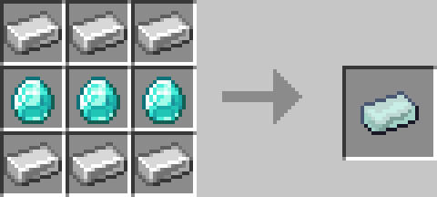
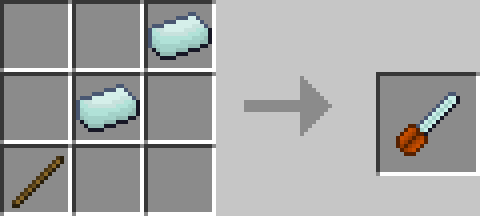
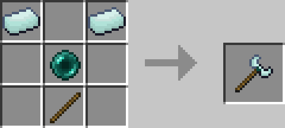
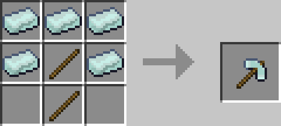
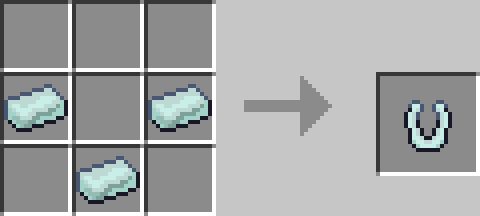
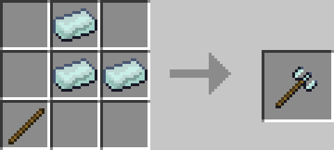
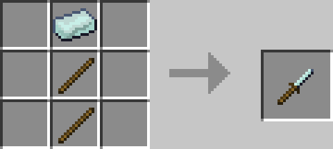
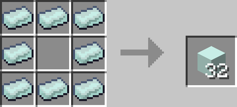

# Mason

Mason is a Minecraft Addon for Bedrock 1.12 that adds many useful survival orientated tools! 

**Note**: This addon is currently in beta, as it Bedrock 1.12 so it will be prone to bugs

## Download: V0.1

## Materials
### Diaron Ingot
Diaron is a Iron-Diamond alloy used to craft all the custom items in this mod
#### Recipe:

## Tools
### Chainsaw
Cut down trees with a single swing!
#### Recipe:

### Displacer
Swap around the positions of almost any 2 blocks (Including Chests, Furnaces etc)
#### Recipe:

### Wrench
Right click a block to rotate it!
#### Recipe:

### Hammer
Destroy a 3\*3\*3 square of the same block with one hit! (Only works on blocks you can break by hand)
#### Recipe:

### Magnet
Attract any nearby items to your player!
#### Recipe:

### Plough
Plough a 3\*3\*3 area!
#### Recipe:

### Screwdriver
Fill any area between two blocks as long as you have the resources!
#### Recipe:

### Clouds
Hold a cloud block to place a cloud 3 blocks in front of you! Useful for building in the air.
#### Recipe:

