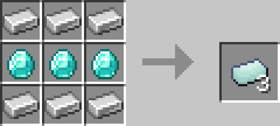
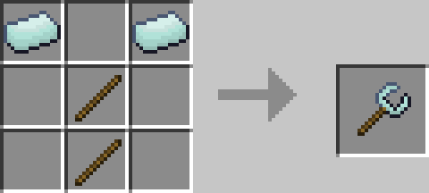
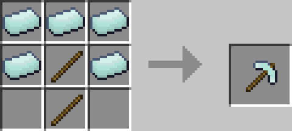
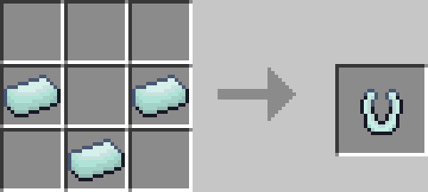
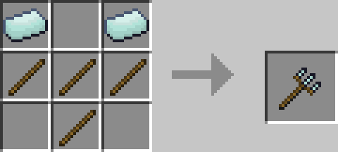
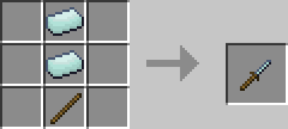
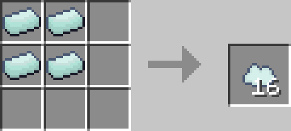

# Mason

Mason is a Minecraft Addon for Bedrock 1.12 that adds many useful survival orientated tools! 

**Note**: This addon is currently in beta, as it Bedrock 1.12 so it will be prone to bugs

## Download: V0.1

# Materials
## Diaron Ingot
### Description:
Diaron is a Iron-Diamond alloy used to craft all the custom items in this mod
### Recipe:

---

# Tools
## Chainsaw
### Description:
Cut down trees with a single swing!
### Recipe:

### Demonstration:

***

## Displacer
### Description:
Swap around the positions of almost any 2 blocks (Including Chests, Furnaces etc)
### Recipe:

### Demonstration:

***

## Wrench
### Description:
Right click a block to rotate it!
### Recipe:

### Demonstration:

***

## Hammer
### Description:
Destroy a 3\*3\*3 square of the same block with one hit! (Only works on blocks you can break by hand)
### Recipe:

### Demonstration:

***

## Magnet
### Description:
Attract any nearby items to your player!
### Recipe:

### Demonstration:

***

## Plough
### Description:
Plough a 3\*3\*3 area!
### Recipe:

### Demonstration:

***

## Screwdriver
### Description:
Fill any area between two blocks as long as you have the resources!
### Recipe:

### Demonstration:

***

## Clouds
### Description:
Hold a cloud block to place a cloud 3 blocks in front of you! Useful for building in the air.
### Recipe:

### Demonstration:

